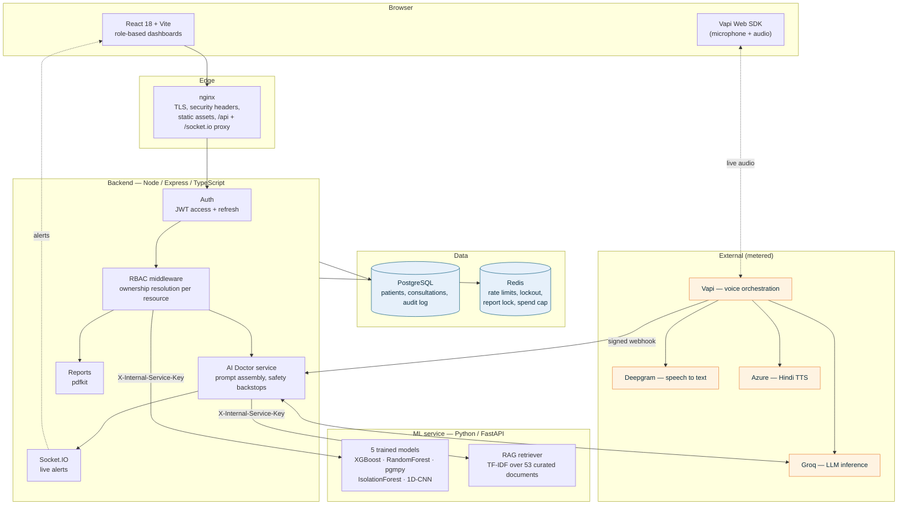
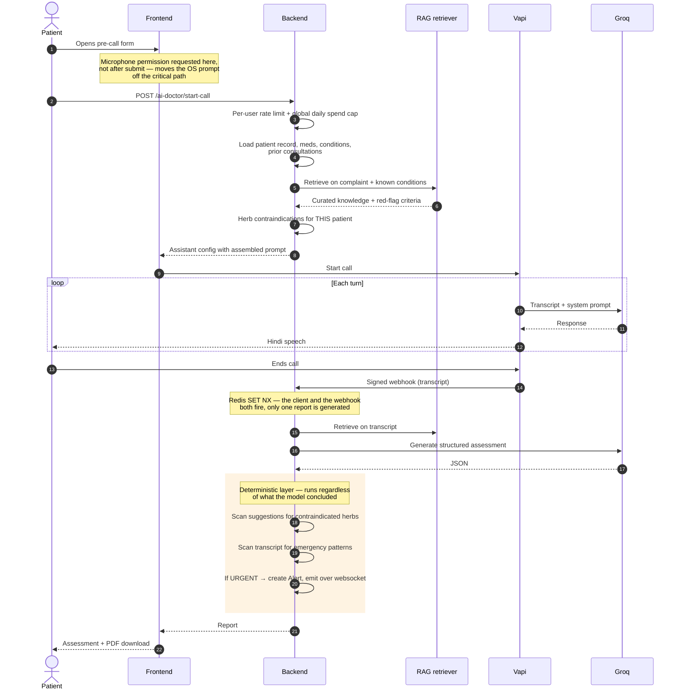

# Architecture

## System overview



The ml-service is never exposed to the browser. Every call to it goes through
the backend carrying a shared internal key, so "reachable" and "allowed" are
separate things even on the internal network.

---

## An AI Doctor consultation, end to end

This is the flow worth understanding — it is where most of the design
decisions live.



**Why retrieval happens twice and never per turn.** Grounding is injected
into the system prompt at call setup and again when the report is generated.
Retrieving per conversation turn would put a network hop inside the live
voice loop, where every added millisecond is audible as a pause.

**Why the deterministic layer exists.** An LLM is not a safety mechanism. The
herb and emergency checks run on every consultation regardless of what the
model concluded, which is the only way they are worth anything.

---

## Access control

One middleware handles every patient-scoped route:

```
authenticate → requireOwnership(resourceType)
                  ├─ staff role in allowRoles → pass
                  ├─ PATIENT → resolve resource's owning patient,
                  │            compare against caller's patient record
                  └─ neither → 403 (404 if the resource doesn't exist,
                               so ids of other patients don't leak)
```

Resource resolvers live in one file (`resourceResolvers.ts`), so adding an
ownership-checked route means adding one resolver rather than hand-rolling a
"does this belong to me" query per router — which is how the original
codebase leaked patient data across accounts.

---

## Repository layout

```
backend/          Node/Express/TypeScript, Prisma over PostgreSQL
  src/middleware/   rbac, resourceResolvers, rate limiting, webhook verify
  src/modules/      auth, patients, ai-doctor, ml, reports, ...
  tests/            38 tests — auth, RBAC, safety backstops, PDF rendering

ml-service/       Python/FastAPI
  app/api/routes/   one router per model + RAG retrieval
  app/ml/           model architectures (shared by training and serving)
  app/rag/          retriever + curated corpus (53 documents)
  train/            reproducible training scripts, one per model
  models_manifest.json   metrics and artifact hashes — the source of truth
  tests/            22 tests — retrieval quality, red-flag surfacing

frontend/         React 18 + Vite + Zustand
  src/index.css     design tokens — one palette, swapped by editing values
  src/components/ui/  shared component library
  src/pages/        25 pages across 5 roles
```

`models_manifest.json` is deliberately the single source of ML truth: the
serving routes read their reported metrics from it rather than hardcoding
numbers, so a retrain cannot leave the API advertising results the model no
longer achieves.
