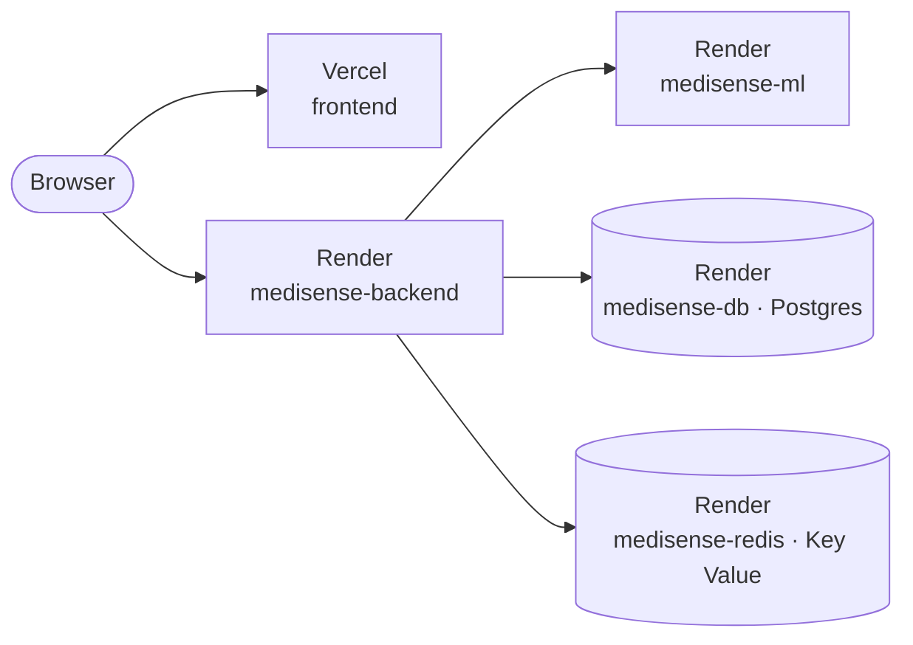

# Deploying MediSense AI — Render + Vercel, click by click

Everything here runs on free plans. The one genuine cost is voice calls —
read [Voice call costs](#voice-call-costs) before demo day, because that part
is not free and cannot be made free.

You create the accounts and paste a handful of values; the repo does the
rest. Plan on 30–40 minutes, most of it waiting for Docker builds.

---

## What you end up with



| Piece | Where | Created by |
|---|---|---|
| Frontend (static Vite build) | Vercel | Importing `frontend/` |
| Backend — Node / Express | Render web service `medisense-backend` | [`render.yaml`](render.yaml) |
| ML service — FastAPI | Render web service `medisense-ml` | [`render.yaml`](render.yaml) |
| Postgres | Render database `medisense-db` | [`render.yaml`](render.yaml) |
| Redis | Render Key Value `medisense-redis` | [`render.yaml`](render.yaml) |

Everything on Render is in the **Singapore** region, the closest to India.

**Order matters.** Render first, because the frontend needs the backend's URL
at *build* time — Vite bakes `VITE_*` values into the bundle. Then Vercel.
Then one last trip back to Render to tell the backend where the frontend lives.

## Before you start

- [ ] The code is on GitHub (this repo).
- [ ] A **Render** account and a **Vercel** account. Sign up to both *with GitHub* — it saves a step later.
- [ ] **Node.js 20** on your PC, for the one-time demo-data seed. You already have it if you've run the project locally.
- [ ] *Optional, only for the voice AI Doctor:* a [Vapi](https://dashboard.vapi.ai) account and a [Groq](https://console.groq.com/keys) API key. Everything else works without them.

---

## Step 1 — Render: the whole backend in one Blueprint

`render.yaml` describes four resources and wires them together — database
URL, Redis URL, a generated key shared between the two services, generated
JWT secrets. You type in five values.

1. Open **[dashboard.render.com](https://dashboard.render.com)** and sign in with GitHub.
2. Top right: **+ New** → **Blueprint**.
3. Under *Connect a repository*, find **medisense-Ai** → **Connect**.
   - Not in the list? Click **Configure GitHub** (or **+ Connect account** → **GitHub**), give Render access to the repository, and come back — it now shows up.
4. Fill in the form:
   - **Blueprint Name:** `medisense-ai`
   - **Branch:** `main`
   - **Blueprint Path:** leave empty — it defaults to `render.yaml`
5. Render reads `render.yaml` and lists what it will create — `medisense-db`,
   `medisense-redis`, `medisense-ml`, `medisense-backend` — then asks for the
   values it can't generate:

   | Variable | What to enter |
   |---|---|
   | `ML_SERVICE_URL` | `https://medisense-ml.onrender.com` — you confirm the exact URL in step 8 |
   | `FRONTEND_URL` | `https://medisense-ai.vercel.app` — a placeholder; the real one goes in at Step 4 |
   | `VAPI_API_KEY` | Vapi dashboard → **API Keys** → *Private Key*. No Vapi yet? Type `not-configured` |
   | `VAPI_PUBLIC_KEY` | Vapi dashboard → **API Keys** → *Public Key*. Or `not-configured` |
   | `GROQ_API_KEY` | console.groq.com → **API Keys** → **Create API Key**. Or `not-configured` |

   The backend refuses to boot with an empty Vapi key, which is why the
   placeholder matters: with it, everything except the voice call works, and
   you can paste the real keys in later.
6. Click **Deploy Blueprint** (some dashboards label it **Apply**).
7. Wait. Postgres and Key Value are ready within a couple of minutes.
   `medisense-ml` takes longest — about 10 minutes, it installs PyTorch — and
   `medisense-backend` about 5. Each one turns green: **Live**.
   - On its first boot the backend creates every database table itself
     (`RUN_MIGRATIONS=true` in `render.yaml`). There is nothing to run for that.
8. **Confirm the ML service URL.** Click **medisense-ml** in the dashboard —
   its URL is under the name at the top. If it isn't exactly what you typed
   for `ML_SERVICE_URL` (Render adds a suffix when a name is already taken):
   - **medisense-backend** → **Environment** (left sidebar) → `ML_SERVICE_URL`
     → **Edit** → paste the real URL → **Save, rebuild, and deploy**.
9. Copy **medisense-backend**'s URL — Vercel needs it next. Then open both
   health checks in a browser:
   - `https://<backend-url>/health` → `{"status":"ok", …}`
   - `https://<ml-url>/api/health` → `"models_ready": true`

   The first request after a quiet spell takes about a minute: free services
   sleep after 15 minutes without traffic.

## Step 2 — Load the demo data (once, from your PC)

The tables exist but they're empty — nobody can log in yet. The seed creates
the demo accounts and a set of sample patients.

1. Render dashboard → **medisense-db** → **Connect** (top right) → **External**
   tab → copy the **External Database URL**.
2. On your PC, open PowerShell in the project folder:

   ```powershell
   cd backend
   npm install                                        # skip if you've run the project before
   $env:DATABASE_URL = "PASTE-EXTERNAL-DATABASE-URL-HERE"
   npx prisma db seed
   Remove-Item Env:DATABASE_URL                       # so later local runs use your .env again
   ```

   If it fails with an SSL/TLS error, add `?sslmode=require` to the end of the URL and run it again.

   It inserts 5,000 sample patients and a week of vitals for 100 of them, so
   over the internet it takes a few minutes — let it finish, and run it once.
3. It finishes by printing the demo logins. All of them use the password
   `MediSense@2024`: `admin@medisense.ai` · `doctor@medisense.ai` · `patient@medisense.ai`

## Step 3 — Vercel: the frontend

1. Open **[vercel.com](https://vercel.com)** and sign in with GitHub.
2. **Add New…** (top right) → **Project**.
3. Under *Import Git Repository*, find **medisense-Ai** → **Import**.
   - Not listed? Click **Adjust GitHub App Permissions →**, allow the repository, and come back.
4. On *Configure Project*:
   - **Project Name:** `medisense-ai` — it becomes `medisense-ai.vercel.app` if that name is free
   - **Root Directory:** click **Edit** → select **frontend** → **Continue**
   - **Framework Preset:** shows **Vite** once the root directory is set
   - **Build and Output Settings:** leave them alone. `frontend/vercel.json`
     sets them, along with the rewrite that makes refreshing `/dashboard`,
     `/ai-doctor` and other deep links work instead of returning 404.
5. Open **Environment Variables** and add two, both set to the backend URL from Step 1:

   | Key | Value |
   |---|---|
   | `VITE_API_URL` | `https://medisense-backend.onrender.com` |
   | `VITE_SOCKET_URL` | `https://medisense-backend.onrender.com` |

   No trailing slash and no `/api/v1` — the app adds that itself.
6. Click **Deploy**. About a minute later: *Congratulations!* → **Continue to Dashboard**.
7. Copy the URL under **Domains**, for example `https://medisense-ai.vercel.app`.

## Step 4 — Tell the backend where the frontend lives

Until this matches exactly, the browser blocks every API call (CORS) and live
alerts can't connect.

1. Render → **medisense-backend** → **Environment** → `FRONTEND_URL` → **Edit**.
2. Paste the Vercel URL — with `https://`, **without** a trailing slash.
3. **Save, rebuild, and deploy**, and wait for **Live**.

Now open the Vercel URL and sign in as `admin@medisense.ai` / `MediSense@2024`.

> Only that production URL is allowed. Vercel's per-commit preview URLs
> (`…-git-….vercel.app`) will show CORS errors — that's expected.

## Step 5 (optional) — Voice AI Doctor: the Vapi webhook

A call works as soon as the Vapi and Groq keys are real. Getting the
transcript and report *back* needs one more link: Vapi must send its
end-of-call webhook to the backend, carrying the shared secret.

1. If you used placeholders, put the real keys in: Render →
   **medisense-backend** → **Environment** → edit `VAPI_API_KEY`,
   `VAPI_PUBLIC_KEY`, `GROQ_API_KEY` → **Save, rebuild, and deploy**.
2. Copy the webhook secret Render generated: same page → `VAPI_WEBHOOK_SECRET`
   → click the eye icon to reveal it → copy.
3. In the Vapi dashboard, create a credential that carries it:
   **Integrations** → **Server Configuration** → **Add Custom Credential**
   - **Authentication type:** Bearer Token
   - **Credential Name:** `medisense-webhook`
   - **Token:** the secret from step 2
   - **Header Name:** `X-Vapi-Secret`
   - **Include Bearer Prefix:** **off**
4. Set the organization's Server URL: **Settings** (organization / general
   settings) → **Server URL** → `https://<backend-url>/api/v1/ai-doctor/webhook`,
   and pick the `medisense-webhook` credential for it.

The app starts each call with an inline assistant, not one saved in the Vapi
dashboard, so the webhook goes to the organization-level Server URL — there is
no per-assistant setting to change. Vapi reorganises its dashboard from time
to time; if the labels differ, the goal stays the same: the organization's
Server URL points at `/api/v1/ai-doctor/webhook`, and every request carries
the header `X-Vapi-Secret: <VAPI_WEBHOOK_SECRET>`.

Without it the backend rejects the webhook, and consultations never receive
their transcript or report.

---

## Updating

Push to `main`. Render rebuilds only the service whose folder changed
(`buildFilter` in `render.yaml`) and Vercel rebuilds the frontend. New Prisma
migrations apply by themselves when the backend restarts.

---

## Voice call costs

This is the one part that is not free, and it is worth being clear about
before demo day.

Vapi bills per minute — roughly $0.05/min platform fee plus the underlying
speech-to-text, LLM and text-to-speech costs, landing around **$0.07–0.25 per
minute** in practice. New accounts get about $10 in trial credit, so budget
roughly **40–140 minutes of total talk time**, not unlimited use.

Two things follow from that:

- `AI_DOCTOR_DAILY_CALL_CAP` is a real spend guard, not decoration. It is
  enforced globally across all users, not per user. Leave it low.
- Check your remaining Vapi credit before demo day. Nothing in the app can
  see that balance.

Hindi voice specifically: Deepgram Aura has no Hindi voices, and Vapi's own
bundled set is small and largely English, so Azure's `hi-IN-MadhurNeural`
(the configured default, a male voice to match Dr. Arjun) is the practical
option. `AI_DOCTOR_TTS_PROVIDER` and `AI_DOCTOR_TTS_VOICE_ID` let you switch
without a code change if that changes.

---

## Free-tier limits worth knowing

| | Limit | What it means for a demo |
|---|---|---|
| **Sleep** | Services sleep after 15 minutes without traffic; waking takes about a minute | Open both URLs a few minutes before a demo. The ML service is the slower of the two to wake. |
| **Instance hours** | 750 free hours per workspace per month | Two services that sleep most of the time fit easily. Keeping both awake 24/7 with an uptime pinger (2 × 720 h) does not — they would be suspended for the rest of the month. |
| **Memory** | 512 MB per service | Measured: the ML service sits at ~300 MB with all seven models loaded and after predictions; the backend at ~60 MB. The ML service runs one worker on purpose — raising `WEB_CONCURRENCY` will run it out of memory. |
| **Postgres** | 1 GB. **Expires 30 days after creation** (then 14 days to upgrade). One free database per workspace | Fine for a demo window. For longer, use [Neon](#using-neon-for-a-database-that-doesnt-expire). |
| **Key Value** | In memory only | A restart clears rate-limit counters and the daily call cap. Harmless. |
| **Email** | Outbound SMTP ports are blocked on free instances | Forgot-password emails don't send; the reset link is written to the backend's **Logs** instead. |

### Using Neon for a database that doesn't expire

1. Create a free project at [neon.tech](https://neon.tech) — region Singapore, next to the Render services.
2. On the project dashboard, **Connect** → copy the connection string. Use the
   **direct** one (host *without* `-pooler`): the backend runs migrations on
   boot, and Prisma Migrate needs a direct connection.
3. Render → **medisense-backend** → **Environment** → `DATABASE_URL` → replace
   the value with the Neon string → **Save, rebuild, and deploy**. The backend
   creates the tables when it starts.
4. Run [Step 2](#step-2--load-the-demo-data-once-from-your-pc) again with the Neon string.

To make the switch permanent, also change the `DATABASE_URL` entry in
`render.yaml` from `fromDatabase` to `sync: false` — otherwise a later
Blueprint sync points it back at the Render database.

---

## Post-deploy smoke test

Run this against the live URLs, not localhost. It follows the same path a
judge will.

1. `https://<backend>/health` returns `{"status":"ok"}`.
2. `https://<ml>/api/health` reports `"models_ready": true`.
3. Register a new patient account, sign out, and sign back in.
4. As the doctor: **AI Clinical Tools** → **Heart Risk** → fill the form →
   predict. A probability and recommendations come back.
5. **CBC Analyzer** accepts values and returns an interpretation.
6. **Research & Analytics** loads its population statistics.
7. *(Voice set up?)* As the patient: **AI Doctor** → **Start Consultation**.
   The microphone prompt appears and Dr. Arjun speaks the opening line in
   Hindi. End the call, wait for the report, download the PDF.
8. As the doctor, open that patient — the consultation is on their page.
9. Trigger an alert and watch it arrive live. This is what breaks first when
   `FRONTEND_URL` isn't an exact match.

## If something breaks

| Symptom | Cause and fix |
|---|---|
| `medisense-ml` build fails | Open its **Logs**. A `pip` download timeout is usually transient — **Manual Deploy** → **Deploy latest commit**. |
| Backend keeps restarting | A required variable is missing or empty — the first log lines name it. |
| `"models_ready": false` | The model files didn't reach the build. They're committed under `ml-service/app/models/`; check nothing re-ignored them. |
| Every API call fails with CORS errors | `FRONTEND_URL` doesn't exactly match the Vercel URL — scheme included, no trailing slash. |
| Alerts don't arrive live | Same cause — the Socket.IO allowlist reads `FRONTEND_URL` too. |
| Refreshing a page on Vercel gives 404 | The Root Directory isn't `frontend`, so `frontend/vercel.json` wasn't picked up. |
| Requests go to the Vercel domain instead of Render (browser **Network** tab) | `VITE_API_URL` wasn't set at build time. Set it, then **Deployments** → **⋯** → **Redeploy**. |
| ML routes return 401 | `ML_SERVICE_INTERNAL_KEY` ≠ `INTERNAL_API_KEY`. The Blueprint links them — don't edit either by hand. |
| ML routes time out or return 502 | `ML_SERVICE_URL` is wrong, or the ML service is still waking up. |
| Demo login says "Invalid email or password" | [Step 2](#step-2--load-the-demo-data-once-from-your-pc) hasn't been run against this database. |
| A call connects but no report arrives | The Vapi Server URL or `X-Vapi-Secret` doesn't match — [Step 5](#step-5-optional--voice-ai-doctor-the-vapi-webhook). |
| `/start-call` returns 503 | The daily cap was reached — `AI_DOCTOR_DAILY_CALL_CAP`. |
| The first request takes about a minute | Free-tier cold start. Warm both services before demoing. |
