<div align="center">

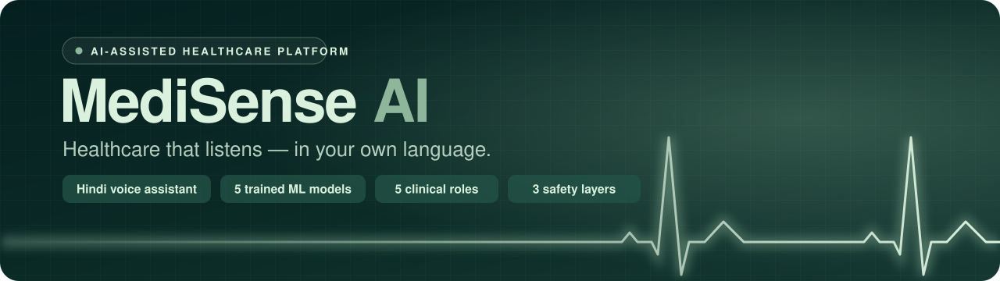

<h3>An AI-assisted hospital platform built around a Hindi-speaking voice health assistant,<br/>five trained clinical ML models, and a complete five-role hospital workflow.</h3>

<p>
  
  
  
  
  
  
  
  
</p>

<p>
  <a href="#-screenshots"><b>Screenshots</b></a> &nbsp;·&nbsp;
  <a href="#-how-a-consultation-works"><b>How it works</b></a> &nbsp;·&nbsp;
  <a href="#-the-models"><b>Models</b></a> &nbsp;·&nbsp;
  <a href="#-run-it-locally"><b>Run locally</b></a> &nbsp;·&nbsp;
  <a href="DEPLOYMENT.md"><b>Deploy</b></a> &nbsp;·&nbsp;
  <a href="LIMITATIONS.md"><b>Limitations</b></a>
</p>

<!-- After deploying, put your live link here, for example:
<a href="https://your-app.vercel.app"></a>
-->

<a href="https://render.com/deploy?repo=https://github.com/jack121200/medisense-Ai"></a>

</div>

<br/>

> [!IMPORTANT]
> **Not a medical device.** This is an academic project. It does not diagnose, does not prescribe, and every output is framed for review by a qualified doctor. In an emergency in India, call **108**.

A patient describes how they feel, in their own language. The assistant takes a structured clinical history, grounds its advice in a curated knowledge base rather than model memory, and produces a reviewable assessment that lands on a clinician's dashboard as a report and a PDF.

<table>
<tr>
<td width="33%" valign="top">

#### 🎙️ Voice-first, in Hindi
**Dr. Arjun**, the AI health assistant, holds a consultation in Hindi, English or Hinglish. He says up front that he is an AI — not a doctor — works through a 9-phase OPD-style history one question at a time, and hands the real doctor a structured report.

</td>
<td width="33%" valign="top">

#### 🧠 Real models, real numbers
Five models, each trained by a reproducible script. Every metric lives in `models_manifest.json` — the API reads its claims from that file, so a retrain can't leave it advertising stale results.

</td>
<td width="33%" valign="top">

#### 🛡️ Safety that doesn't trust the LLM
Deterministic checks run under every consultation: herb contraindications against the patient's own meds and conditions, emergency-pattern scanning, and live alerts for anything urgent.

</td>
</tr>
</table>

---

## 📸 Screenshots

<p align="center">
  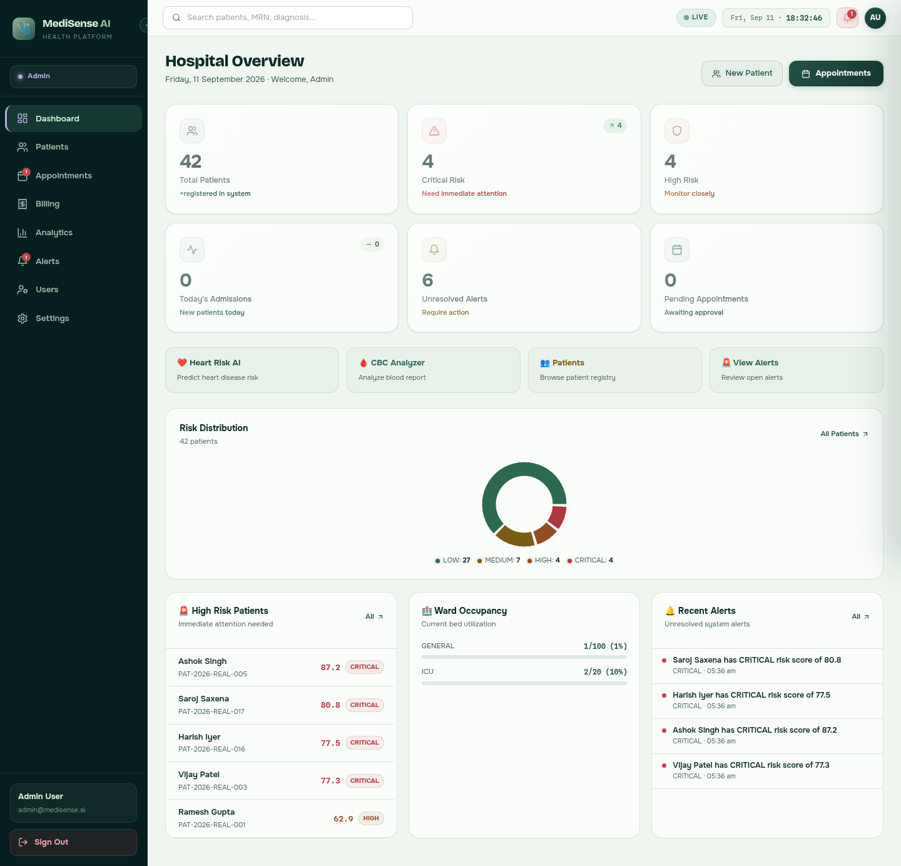
  <br/>
  <sub><b>Hospital overview</b> — risk distribution across every patient, the critical cases, ward occupancy and unresolved alerts, all live</sub>
</p>

<table>
  <tr>
    <td width="50%" valign="top">
      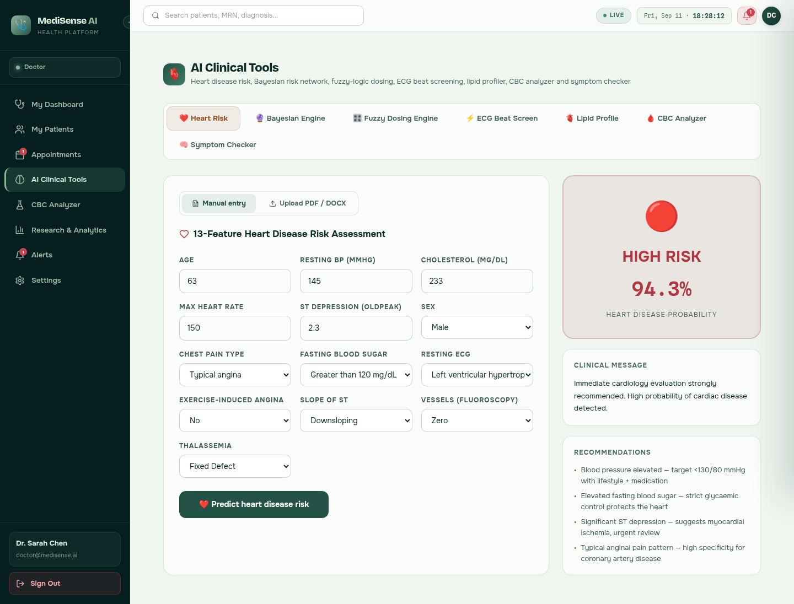
      <br/><sub><b>Heart disease risk</b> — XGBoost over 13 clinical features returns a probability, a clinical message and the reasons behind it</sub>
    </td>
    <td width="50%" valign="top">
      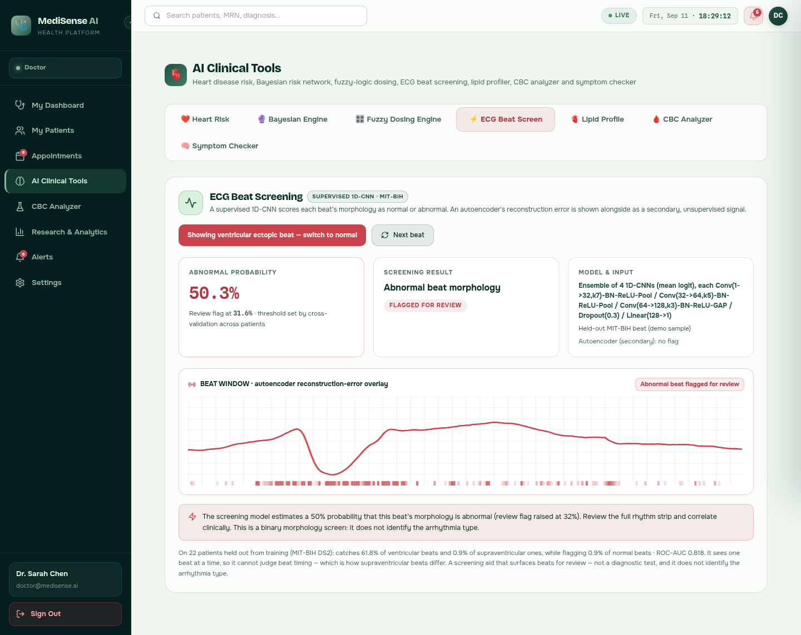
      <br/><sub><b>ECG beat screening</b> — a 1D-CNN ensemble scores each beat and flags abnormal morphology for review, with its held-out numbers on screen</sub>
    </td>
  </tr>
  <tr>
    <td width="50%" valign="top">
      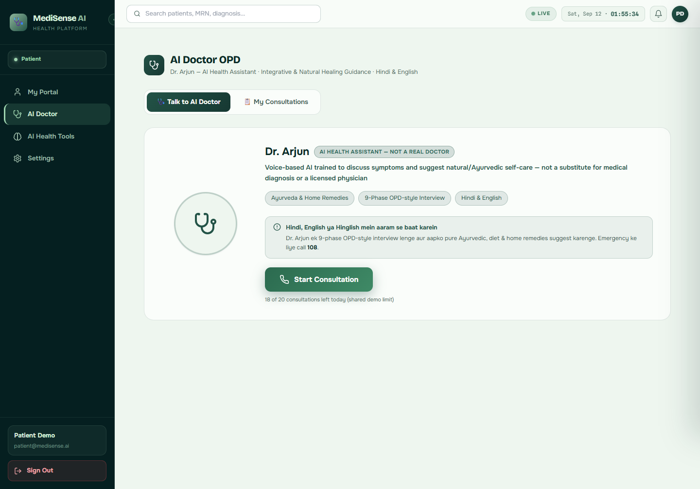
      <br/><sub><b>AI Doctor</b> — Dr. Arjun is labelled as an AI up front; a shared daily call cap keeps metered voice spend bounded</sub>
    </td>
    <td width="50%" valign="top">
      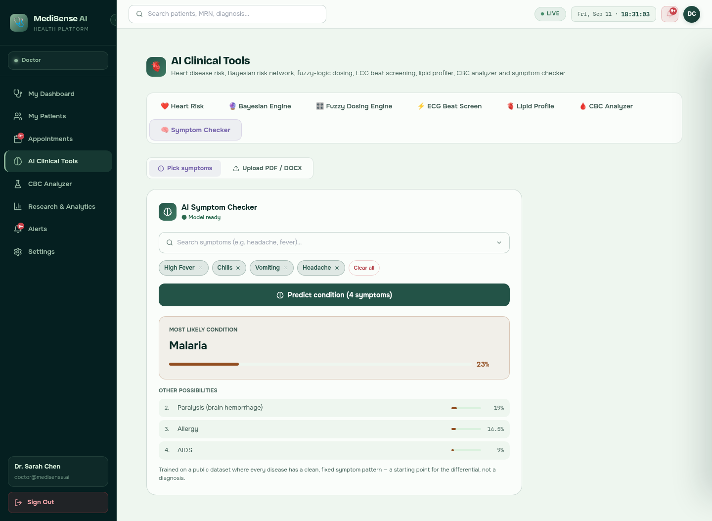
      <br/><sub><b>Symptom checker</b> — a ranked differential, with the training-data caveat stated right under the result</sub>
    </td>
  </tr>
  <tr>
    <td width="50%" valign="top">
      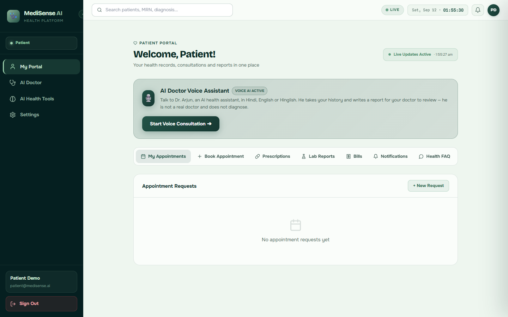
      <br/><sub><b>Patient portal</b> — appointments, prescriptions, lab reports, bills and the voice assistant in one place</sub>
    </td>
    <td width="50%" valign="top">
      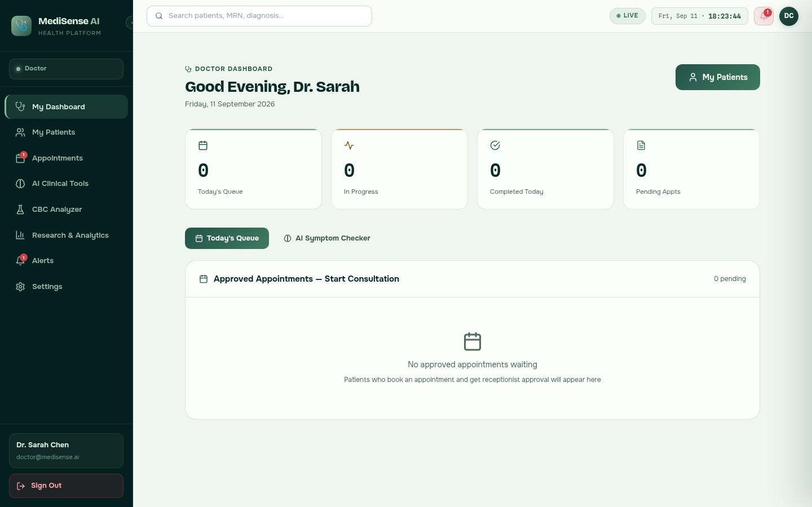
      <br/><sub><b>Doctor dashboard</b> — today's queue, in-progress and completed consultations</sub>
    </td>
  </tr>
  <tr>
    <td width="50%" valign="top">
      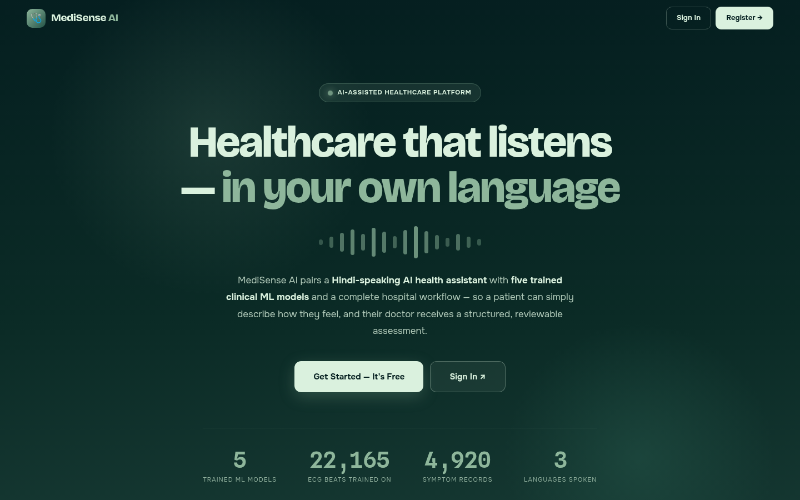
      <br/><sub><b>Landing page</b></sub>
    </td>
    <td width="50%" valign="top">
      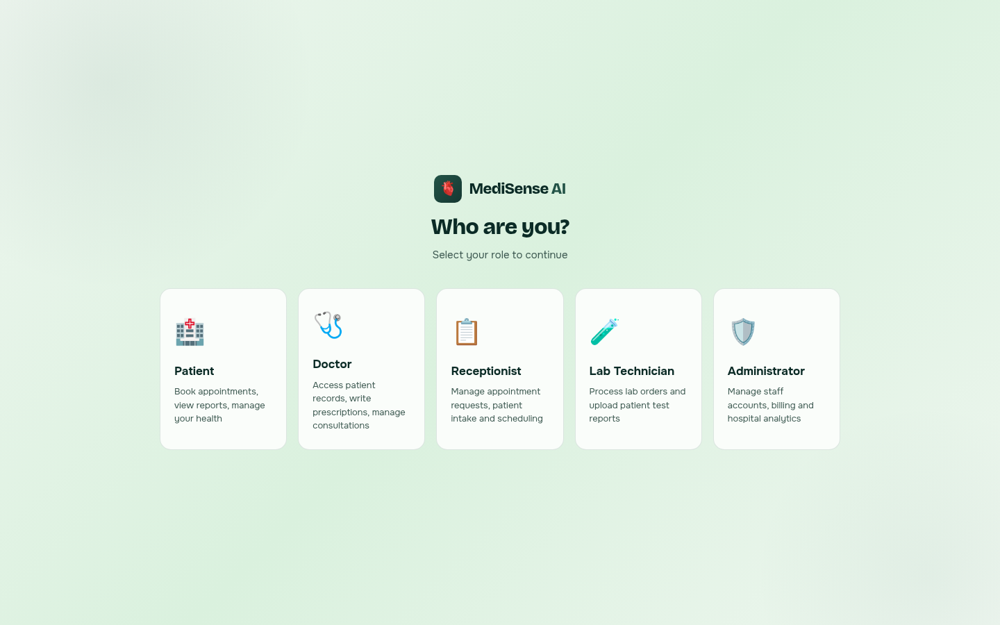
      <br/><sub><b>Sign-in</b> — one entry point for all five roles</sub>
    </td>
  </tr>
</table>

---

## 🔍 How a consultation works

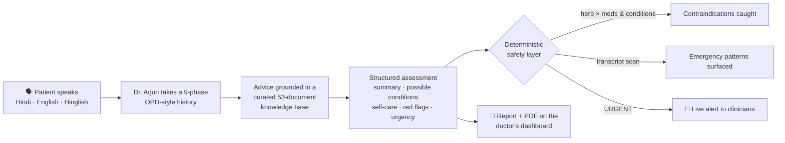

Three safety layers run underneath the model, because an LLM cannot be the only safeguard in anything health-adjacent:

- **Contraindications** — suggested herbs are cross-checked against the patient's recorded medications and conditions. Licorice suggested to a hypertensive patient gets caught regardless of what the model was thinking.
- **Emergency patterns** — transcripts are scanned for red flags independently of whether the model noticed them.
- **Real alerts** — an URGENT result creates a clinical alert pushed over websockets, not a warning buried in a JSON field.

The full sequence diagram, and why retrieval happens twice but never per turn, is in [ARCHITECTURE.md](ARCHITECTURE.md).

---

## 🧪 The models

| Model | Method | Held-out result |
|---|---|---|
| Heart disease risk | XGBoost | 0.995 ROC-AUC, 95.5% accuracy |
| Symptom checker | Random Forest | 100% — [read why that's a caveat](LIMITATIONS.md#symptom-checker--the-100-is-a-warning-sign-not-an-achievement) |
| ECG beat screening | Supervised 1D-CNN ensemble | 0.818 ROC-AUC on 22 unseen patients (MIT-BIH DS2); catches 62% of ventricular beats at 0.9% false alarms |
| CBC analyzer | IsolationForest + KMeans | Unsupervised — no accuracy to quote |
| Bayesian risk engine | pgmpy, 7-node DAG | CPDs fit from 1,025 records |

Alongside them, the **AI Clinical Tools** page adds a fuzzy-logic dosing engine and a lipid profiler, and every form can be pre-filled from an uploaded PDF or DOCX report for the clinician to review before predicting.

---

## 👥 Five roles, one platform

| Role | What they get |
|---|---|
| 🏥 **Patient** | Book appointments, talk to the AI Doctor, see prescriptions, lab reports and bills |
| 🩺 **Doctor** | Today's queue, consultations, patient records, AI clinical tools, research analytics |
| 📋 **Receptionist** | Appointment requests, patient intake, scheduling |
| 🧪 **Lab technician** | Lab orders and test-report uploads |
| 🛡️ **Administrator** | Staff accounts, billing, hospital-wide analytics |

Every patient-scoped route goes through one ownership-checking middleware, so a patient can only ever reach their own records — and a request for someone else's gets a 404, not a hint that it exists.

---

## 🏗️ Architecture

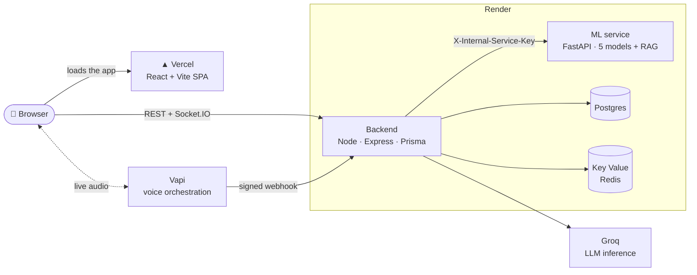

- The ML service is never called from the browser — only the backend reaches it, and only with a shared internal key.
- Redis backs rate limiting, login lockout, the report-generation lock and the AI Doctor's global daily spend cap.
- The client and Vapi's webhook both try to trigger the report; a Redis `SET NX` lock makes sure exactly one is generated.

### Tech stack

| Layer | Stack |
|---|---|
| **Frontend** | React 18 · Vite · TypeScript · Zustand · Tailwind CSS · Recharts · Framer Motion · Socket.IO client |
| **Backend** | Node.js 20 · Express · TypeScript · Prisma · Zod · JWT · Socket.IO · pdfkit · Swagger |
| **ML service** | Python 3.11 · FastAPI · XGBoost · scikit-learn · PyTorch · pgmpy · SciPy |
| **Data** | PostgreSQL · Redis |
| **Voice** | Vapi · Groq · Deepgram · Azure Neural TTS (Hindi) |
| **Infra** | Docker Compose · nginx · GitHub Actions (gitleaks, lint, build, test) · Vercel · Render |

---

## 🚀 Run it locally

You need [Docker Desktop](https://www.docker.com/products/docker-desktop/).

```bash
git clone https://github.com/jack121200/medisense-Ai.git
cd medisense-Ai
cp .env.example .env                                     # fill in every CHANGE_ME

docker compose up --build -d
docker compose exec backend npx prisma migrate deploy           # create the tables
docker compose exec backend npx prisma db seed                  # demo accounts + training data
docker compose exec backend node prisma/seed-real-patients.js   # the patients the dashboards show
```

Open **http://localhost**. The backend validates every required variable at boot and exits naming whichever one is missing.

**Demo accounts** — password `MediSense@2024`

| Role | Email |
|---|---|
| Administrator | `admin@medisense.ai` |
| Doctor | `doctor@medisense.ai` |
| Patient | `patient@medisense.ai` |

Receptionist and lab-technician accounts are created by an administrator from **Users**.

**Tests**

```bash
cd backend && npx jest            # 38 tests — auth, RBAC, safety backstops, PDF rendering
cd ml-service && pytest tests/    # 29 tests — RAG retrieval quality, red-flag surfacing, ECG route
```

---

## ☁️ Deploy your own

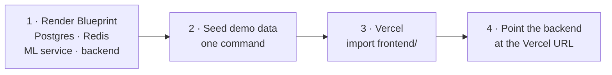

| Piece | Host | Plan |
|---|---|---|
| Frontend | Vercel | Hobby — free |
| Backend + ML service | Render (Docker) | Free |
| Postgres + Key Value | Render | Free |

The whole backend stack is one Render Blueprint ([`render.yaml`](render.yaml)): it creates all four resources, generates every secret, and wires them together. The frontend is a single Vercel import ([`frontend/vercel.json`](frontend/vercel.json)).

**[DEPLOYMENT.md](DEPLOYMENT.md) walks through it click by click** — including free-tier limits worth knowing before a demo, and what voice calls actually cost.

---

## 📁 Project structure

```
medisense-ai/
├── frontend/            React 18 + Vite — 25 pages across 5 roles
│   └── vercel.json      SPA routing + asset caching for Vercel
├── backend/             Express + Prisma — auth, RBAC, AI Doctor, reports, websockets
│   ├── prisma/          schema, migrations, demo seed
│   └── tests/           38 tests
├── ml-service/          FastAPI — model serving and RAG retrieval
│   ├── app/models/      trained artifacts, committed so any host can build the image
│   ├── app/rag/         retriever + curated corpus
│   ├── train/           one reproducible training script per model
│   ├── data/            training datasets
│   └── models_manifest.json   metrics and artifact hashes — the source of ML truth
├── nginx/               reverse proxy for the local stack
├── docs/                banner and screenshots
├── render.yaml          Render Blueprint — backend, ML service, Postgres, Redis
└── docker-compose.yml   the full stack, locally
```

---

## 📚 Documentation

| | |
|---|---|
| [ARCHITECTURE.md](ARCHITECTURE.md) | System diagram, consultation sequence, access-control model |
| [DEPLOYMENT.md](DEPLOYMENT.md) | Click-by-click Render + Vercel deploy, free-tier limits, voice costs |
| [LIMITATIONS.md](LIMITATIONS.md) | Every known weakness, stated plainly with real numbers |
| [DEMO.md](DEMO.md) | A 10-minute demo path and likely examiner questions |

If you are evaluating this project, `LIMITATIONS.md` is the honest one — it covers what does not work as well as what does.

<div align="center">
<br/>
<sub>Built by <b>Jatin Sharma</b> · <a href="https://github.com/jack121200">@jack121200</a></sub>
</div>
